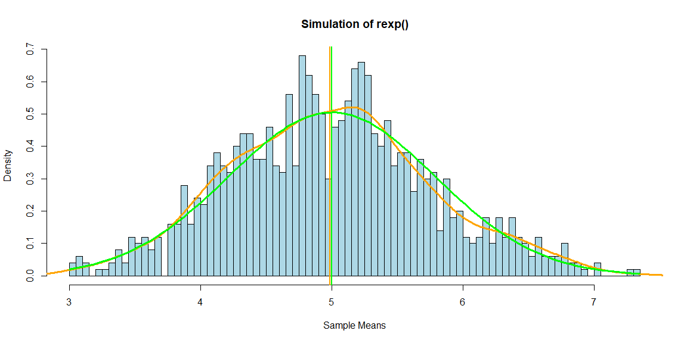
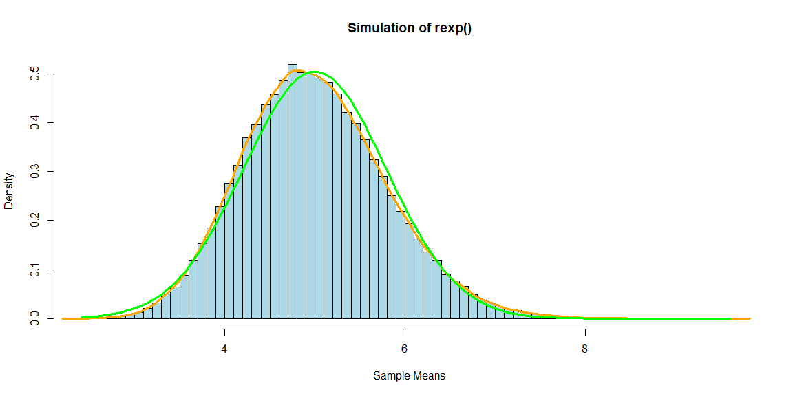

# Simulation Exercise
Jacob Schwartz  
September 9, 2017  

# Overview

In this project we investigate the exponential distribution in R and compare it with the Central Limit Theorem. The exponential distribution can be simulated in R with rexp(n, lambda) where lambda is the rate parameter. The mean of exponential distribution is 1/lambda and the standard deviation is also 1/lambda. In our analysis we can treat this as our null hypothesis. We'll set lambda = 0.2 for all of the simulations. We will also investigate the distribution of averages of 40 exponential samples. We will initially do a thousand simulations.


# Simulations

### Setup

Before we begin, we need to set up our libraries for our analysis. In this case, the only libraries we'll need are related to data sorting, particularly the dplyr package.


```r
library(plyr) #load libraries
library(dplyr)
```

Then we need to initialize our universal variables, mentioned in our synopsis. Specifically, lambda will be 0.2, our sample size (n) will be 40, and, at least initially, we'll be doin 1000 simulations of the exponential function.


```r
lambda<-0.2 #assign default lambda
n<-40 #assign default number of samples
nsim1<-1000 #assign default number of simulations
```

### Initial Simulation

Now that our baseline is set, we can run our initial simulation. First we need to set the seed, for reproducibility (both later on in this exercise, and generally). Then we can run our simulation of the exponential distribution, `rexp(n, lambda)`. We'll run the simulation 1000 times, and store the results in a matrix. Then we can take the mean of each simulation across the samples, and store them in a table of sample means. This will be our sample distribution for testing.


```r
set.seed(1987) #set seed for reproducibility

sim1<-matrix(data=rexp(n*nsim1,rate=lambda),nrow=nsim1,ncol=n) #create raw simulation matrix for rexp()
sim1_mean<-data.frame(Mean=rowMeans(sim1)) #take mean of each simulation, and store in data frame
sim1_mean<-mutate(sim1_mean,Index=row.names(sim1_mean))%>%select(Index,Mean) #tidy data frame
head(sim1_mean)
```

```
  Index     Mean
1     1 5.067131
2     2 4.150794
3     3 5.594346
4     4 5.214660
5     5 5.807401
6     6 4.390094
```

We can see the sampled means above, but that doesn't give us a very good idea of the overall distribution. For that we need more information, and graphical representation.

### Sample Mean vs. Theoretical Mean

So let's do a comparison of the sample and theoretical population means.


```r
mean_sample1<-mean(sim1_mean$Mean) #find sample mean
mean_theory1<-1/lambda #find population/theoretical mean

print(mean_sample1)
```

```
[1] 4.987329
```

```r
print(mean_theory1)
```

```
[1] 5
```

We can see above that the sample mean of 4.9873292 is extremely close to the theoretical mean of 5. This is a strong indication that we cannot reject the null hypothesis of the population mean being `1/lambda`.


### Sample Variance vs. Theoretical Variance

Now let's do a comparison of the sample and theoretical population variances.


```r
var_sample1<-var(sim1_mean$Mean) #find sample variance
var_theory1<-(1/lambda)^2/n #find population/theoretical variance

print(var_sample1)
```

```
[1] 0.5896946
```

```r
print(var_theory1)
```

```
[1] 0.625
```

Again, we can see above that the sample variance of 0.5896946 is extremely close to the theoretical variance of 0.625. This is a strong indication that we cannot reject the null hypothesis of the population standard deviation being `1/lambda` either.

We can also use this information, and the means we calculated earlier, to plot a graph of the theoretical and sample density curves (in orange and green respectively.


```r
x1<-seq(min(sim1_mean$Mean),max(sim1_mean$Mean),length=100) #create x spread for population density curve
y1<-dnorm(x1,mean=mean_theory1,sd=sqrt(var_theory1)) #create y distribution for population density

#graph simulation with density curves
hist(sim1_mean$Mean,breaks=100,freq=FALSE,col="lightblue",main="Simulation of rexp()",xlab="Sample Means")
abline(v=mean_sample1,col="orange",lwd=2)
abline(v=mean_theory1,col="green",lwd=2)
lines(density(sim1_mean$Mean),col="orange",lwd=3) #create sample density curve
lines(x1,y1,col="green",lwd=3)
```

<!-- -->

As we can see, the curves follow one another quite closely, further exemplifying the variance similarity. We can also see the close association between means, since both means are drawn in as vertical lines, the sample one in orange and the theoretical one in green.


### Additional Normality Testing

The density curves in the graph from our variance comparison do a decent job of showing that our simulation of the exponential distribution in R tends toward normality.  However, we can do a few more tests to further confirm this conclusion.

One test we can perform is to calculate the 95% confidence intervals of both the sample and theoretical distributions, and see if they line up (we could also calculate the 68% or 99% confidence intervals, but 95% should suffice for the time being).


```r
conf95_sample1<-mean_sample1+c(-1,1)*qnorm(.975)*sqrt(var_sample1)/sqrt(n) #find 95% confidence intervals
conf95_theory1<-mean_theory1+c(-1,1)*qnorm(.975)*sqrt(var_theory1)/sqrt(n)

print(conf95_sample1)
```

```
[1] 4.749354 5.225304
```

```r
print(conf95_theory1)
```

```
[1] 4.755005 5.244995
```

We see again that the sample confidence interval of 4.749354 to 5.2253044 is extremely close to the theoretical confidene interval of 4.7550045 to 5.2449955.

Finally, we can increase our number of simulations to see if we can push our sample mean distribution even further toward normality. To do this we simply need to increase our `nsim` variable, and reset our seed. Then we can essentially run all of the same simulation and distribution calculations we ran earlier, and graph the result.


```r
nsim2<-100000 #increase number of simulations to demonstrate convergence toward normality
set.seed(1987) #reset seed for reproducibility

sim2<-matrix(data=rexp(n*nsim2,rate=lambda),nrow=nsim2,ncol=n) #recalculate simulation matrix
sim2_mean<-data.frame(Mean=rowMeans(sim2)) #recalculate mean of each simulation
sim2_mean<-mutate(sim2_mean,Index=row.names(sim2_mean))%>%select(Index,Mean)

x2<-seq(min(sim2_mean$Mean),max(sim2_mean$Mean),length=100) #recalculate population density curve
y2<-dnorm(x2,mean=mean_theory1,sd=sqrt(var_theory1))

#graph new simulation with density curves
hist(sim2_mean$Mean,breaks=100,freq=FALSE,col="lightblue",main="Simulation of rexp()",xlab="Sample Means")
lines(density(sim2_mean$Mean),col="orange",lwd=3) #create sample density curve
lines(x2,y2,col="green",lwd=3)
```

<!-- -->

As we can clearly see above, though our simulation does slightly lag the theoretical distribution for the exponential function, it appears to be an excellent approximation overall. And the shape of our sample mean distribution is now an almost perfect bell curve.


# Appendix

```r
sessionInfo()
```

```
R version 3.4.1 (2017-06-30)
Platform: x86_64-w64-mingw32/x64 (64-bit)
Running under: Windows 10 x64 (build 15063)

Matrix products: default

locale:
[1] LC_COLLATE=English_United States.1252 
[2] LC_CTYPE=English_United States.1252   
[3] LC_MONETARY=English_United States.1252
[4] LC_NUMERIC=C                          
[5] LC_TIME=English_United States.1252    

attached base packages:
[1] stats     graphics  grDevices utils     datasets  methods   base     

other attached packages:
[1] bindrcpp_0.2 dplyr_0.7.3  plyr_1.8.4  

loaded via a namespace (and not attached):
 [1] Rcpp_0.12.12     assertthat_0.2.0 digest_0.6.12    rprojroot_1.2   
 [5] R6_2.2.2         backports_1.1.0  magrittr_1.5     evaluate_0.10.1 
 [9] rlang_0.1.2      stringi_1.1.5    rmarkdown_1.6    tools_3.4.1     
[13] stringr_1.2.0    glue_1.1.1       yaml_2.1.14      compiler_3.4.1  
[17] pkgconfig_2.0.1  htmltools_0.3.6  bindr_0.1        knitr_1.17      
[21] tibble_1.3.4    
```
